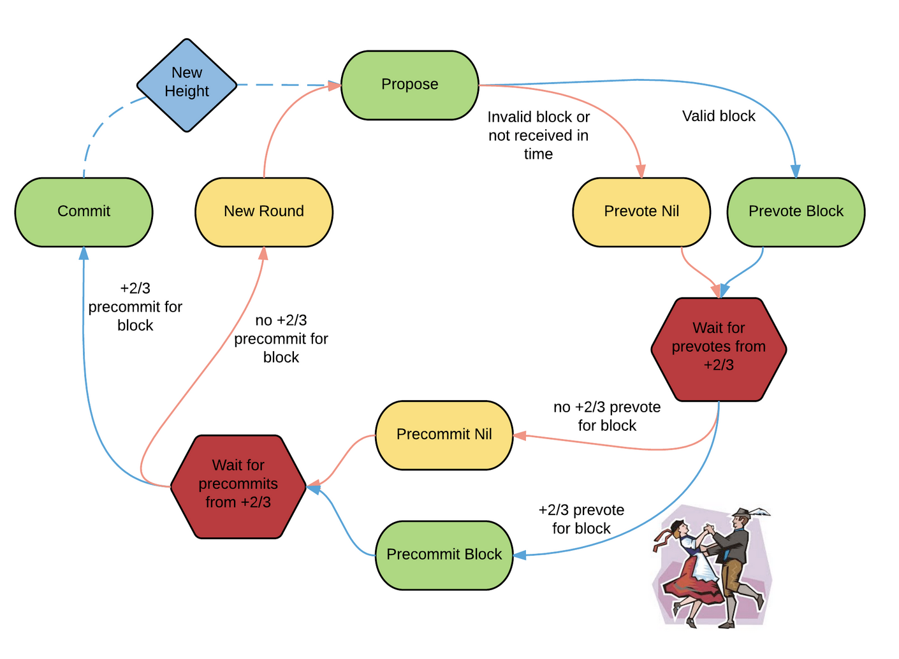

# Cometbft application

### What is Consensus

If there are 3 nodes in a network, we need atleast 2 of them to agree on a state.

In the context of blockchain, consensus is vital for ensuring that all nodes in the network have a consistent and agreed-upon view of the blockchain's transaction history.

There are various consensus algorithms, such as Proof of Work (used in Bitcoin), Proof of Stake, Practical Byzantine Fault Tolerance (PBFT), and others, each with its own approach to achieving consensus.

### CometBFT consensus

- CometBFT is a consensus algorithm designed to provide Byzantine fault-tolerant consensus in a distributed system.
Byzantine fault tolerance is a property of a distributed system that can tolerate the failure of nodes, even if some of them exhibit malicious behavior (Byzantine faults).
- CometBFT employs a Practical Byzantine Fault Tolerance (PBFT)-inspired approach to achieve consensus.
- It introduces the concept of "quorum slices," which are subsets of the network that, when combined, form a full consensus quorum.
- The use of quorum slices in CometBFT allows the algorithm to achieve consensus with fewer messages and faster decision-making compared to traditional PBFT.

for cometbft the algo is relatively simple
a leader is selected for a particular time slot, deterministically
once the leader is selected, they propose a block adding txns from its mempool
it now requires 2/3rd of the network participants to reply that they have added the block to their own copy of blockchain.
the block is then assumed to be committed and block height finalised
once this happens a next round of voting starts

terndermint doc link: https://docs.tendermint.com/v0.34/introduction/what-is-tendermint.html
cometbft doc link: https://docs.cometbft.com/v0.37/guides/go

ABCI is used by the application layer to talk to the blockchain layer.

## CometBFT programme

think sidecar pattern, the process can run on the same machine or over a network.
in case of golang, we can use this as library and create a whole node.

so one is built in app and the other is external application
cosmosSDK follows the built in app pattern while here we will be using the external app pattern.
this keeps our code more modular and the consensus cometbft programme doesnt have access to app state.

## Flow

cometbft receives the transactions and calls certain ABCI methods.
once it validates that the block is valid, it will finally add it to the blockchain.
it calls various methods using ABCI (might be a grpc connection).
`BeginBlock` -> denotes that the application is going to receive block
`DeliverTx` -> called multiple times to deliver the tx to the application, so that the application can build the state
`EndBlock` -> call made to the application to denote no more block will be sent to the application